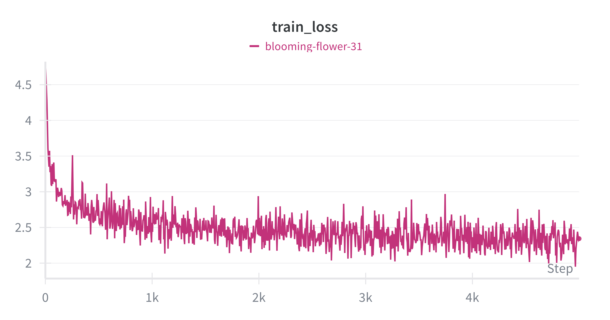

# ScratchGPT

[](https://www.python.org/)
[](https://github.com/astral-sh/uv)
[](https://pytorch.org/)
[](https://wandb.ai/)
[](https://opensource.org/licenses)

ScratchGPT is an end-to-end project to **build, train, and fine-tune a Transformer-based language model from scratch**, covering the full modern LLM pipeline:
data filtering, pretraining, instruction fine-tuning, and evaluation.

The project is inspired by **Andrej Karpathy’s NanoGPT**, and extends it with dataset curation, instruction tuning, and reproducible experimentation.

---

## Project Structure

```

scratchGPT/
├── scratchgpt/            # Core Python package
│   ├── configs/           # Training configurations
│   ├── models/            # Transformer architecture and tokenizer
│   ├── training/          # Training loops
│   ├── inference/         # Text generation
│   └── utils/
├── data/                  # Raw and processed datasets (not versioned)
├── artifacts/             # Checkpoints and tokenizers
├── notebooks/             # Data exploration and preprocessing
├── tests/
├── pyproject.toml
├── uv.lock
└── README.md

````

---

## Training Strategies

### Pretraining

**Objective**  
Learn general language modeling capabilities using an autoregressive next-token prediction objective.

**Datasets**
- FineWeb
- Law Stack Exchange (small subset to introduce structured reasoning patterns)

**Pipeline**
1. Raw data loading and cleaning  
2. Character-level tokenization (`CharTokenizer`)  
3. Cross-entropy loss on next-token prediction  

---

### Instruction Fine-Tuning

**Objective**  
Align the model to follow natural language instructions.

**Datasets**
- Alpaca
- Dolly 15k

**Method**
- Introduce a special separator token (`|||`) between instruction and response
- Compute loss only on the response tokens to avoid instruction copying

---

## Dataset Processing and Filtering

Dataset quality is enforced using `datatrove`.

**Filtering steps**
- Language filtering: keep only English documents
- Quality filtering: remove off-topic or noisy samples
- Domain filtering: refine Law Stack Exchange data

A classifier-based filtering approach is currently work in progress.

---

## Configurations

Two primary configurations are provided.

**LargeConfig**
- Designed for A100-class GPUs
- Larger embedding size and deeper architecture
- Produces coherent and structured generations

**SmallConfig**
- Runs locally
- Intended for experimentation and debugging
- Generates simple but meaningful outputs

---

## Experiment Tracking

All experiments are tracked using Weights & Biases.

Tracked metrics include:
- Training and validation loss
- Hyperparameters
- Model checkpoints
- Cross-run comparisons

Example training curves:

<p align="center">
  
</p>

---

## Running the Project

### Environment setup (reproducible)

```bash
uv sync
````

### Training

```bash
uv run train
```

### Inference

```bash
uv run infer
```

---

## Future Work

* Advanced dataset filtering using FineWeb heuristics
* Direct Preference Optimization (DPO)
* Chinchilla-style scaling laws
* Quantitative evaluation benchmarks
* Multi-tokenizer experiments

---

## Acknowledgements

* Andrej Karpathy — NanoGPT
* The open-source LLM and data curation community
